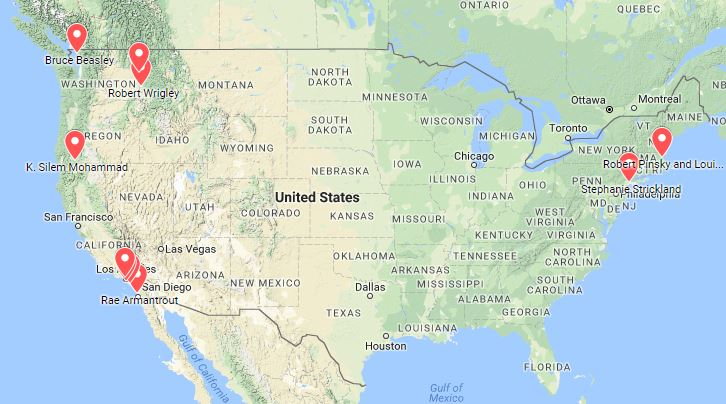

<h1>What is CTRL+SHIFT?</h1>
<iframe src="https://www.google.com/maps/d/embed?mid=1g_5do2uHaVD7wxgKix-A6NEuy0M"  height="450" style="float:right;margin:0px 0px 10px 20px; width: 55%;" id="mymap"></iframe>

<h2>The Short Answer</h2>

CTRL+Shift is an online collection of audio recordings, transcripts, process visualizations, and data analyses broken out from interviews conducted with 11 prominent contemporary American poets from across the United States. The project examines recent changes in writing practices that occurred due to the advent of the computer and the arrival of the digital age and investigates new modes of working with and publishing data from qualitative interview studies. Devin Becker conducted the interviews in 2013 and 2014 as part of a University of Idaho Seed Grant award. Becker collaborated with Corey Oglesby and Lauren Westerfield (both MFA candidates at the University of Idaho in the summer of 2017) to analyze and publish the data and findings online at CTRL+Shift.org.

<h2>But what is it really?</h2> 

CTRL+Shift is a way of seeing—from various angles—how creative people work. 

CTRL+Shift began as something of an ethnographic survey, and ended up a meta-narrative of digital/creative process. From November 2013 to June 2014, Idaho-based poet and librarian Devin Becker traveled around the country interviewing 11 prominent poets about their writing practices. Throughout these interviews, Becker paid particular attention to shifts in each poet’s physical (i.e. drafting) and creative (i.e. research and inspiration) processes in relation to the dawn of personal computing. 

Most of his subjects—including [Louise Gluck](interviews/gluck), [Robert Pinsky](interviews/gluck), and [Rae Armantrout](interviews/armantrout)—began their careers in the analog era, and share common experience with transitional tools (from yellow legal pads to Selectric typewriters) that helped carry them into the age of digital research, version control, and Cloud-based archiving practice. Along the way, Becker also gained insights into the enduring physical aspects of each poet’s work—from [Bruce Beasley’s](interviews/beasley) requisite pre-writing daily walks, to [Stephanie Strickland’s](interviews/strickland) palimpsestic note-taking habits. 

As poets themselves, Becker, Oglesby, and Westerfield were uniquely positioned to engage with each subject's thoughts on the way digital tools have influenced both production and preservation of creative work. And as he began organizing and assessing his results, Becker likewise began to see how the task of digitally organizing this material might become it’s own meta-process narrative. 

Ultlimately, the challenge of structuring each poet’s process within a digital venue became a repeated exercise in "breaking down to build back up"—that is, fragmenting and re-ordering interview data in the same way Beasley or Strickland might cull stray lines to start a new poem.

<h2>People</h2>

<a href="http://devinbecker.org">Devin Becker</a> is the director of the Center for Digital Inquiry and Learning (CDIL) and the Head of Data & Digital Services at the University of Idaho Library. In earlier research, Becker looked at the personal digital archiving practices of emerging writers in a <a href="https://doi.org/10.17723/aarc.75.2.t024180533382067">2012 American Archivist article</a>. His first collection of poetry, <a href="https://www.boaeditions.org/products/shame-shame">Shame | Shame</a>, was selected by David St. John as the winner of the thirteenth annual A. Poulin Jr. Poetry Prize and published by BOA Editions LTD in 2015.

<a href="http://coreyoglesby.com">Corey Oglesby</a> is a poet, musician, and illustrator from the Washington, D.C., area. His work has recently appeared or is forthcoming in Barrow Street, DIAGRAM, Beloit Poetry Journal, Queen Mob’s Teahouse, and elsewhere. Currently the Editor-in-Chief of the literary journal Fugue, he earned his M.F.A. in Poetry at the University of Idaho, where he also helped run the Vandal Poem of the Day web project.

<a href="http://www.laurenwesterfield.com/">Lauren Westerfield</a> is an essayist and poet from the Northern California coast. Her work has appeared or is forthcoming in DIAGRAM, Sonora Review, [PANK], Hobart, The Baltimore Review, Phoebe, Permafrost, Noble/Gas Quarterly, and The Rumpus, where she has also served as an Assistant Essays Editor. Lauren received an MFA in Creative Nonfiction from the University of Idaho, where she was a Centrum Fellow, earned Honorable Mention for the Academy of American Poets Prize, and was nominated for Best New Poets 2018.

 
{{collab | markdownify}}

 

 

 
{{tech | markdownify}}

